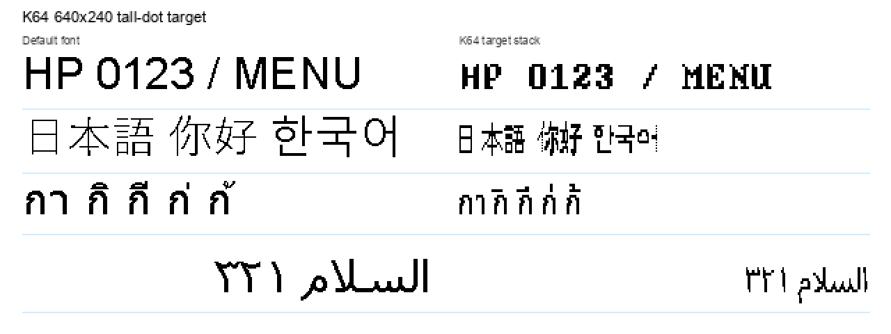
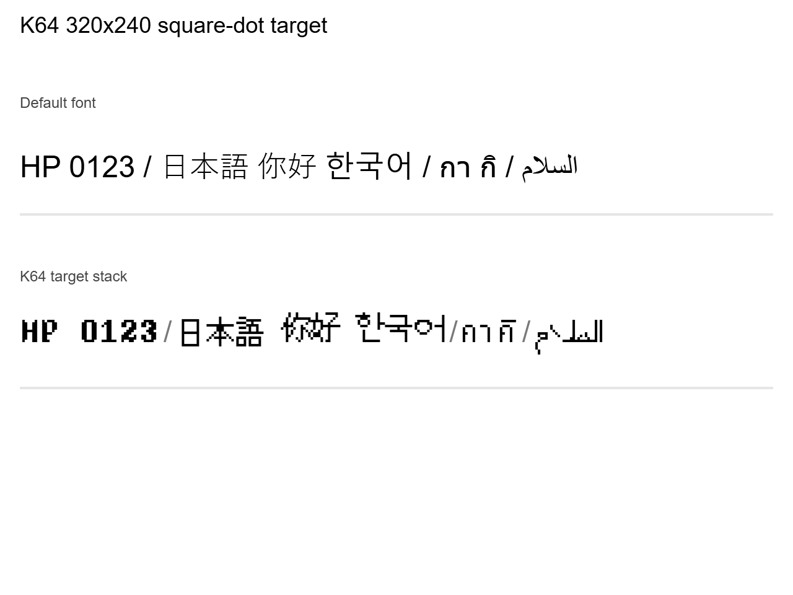
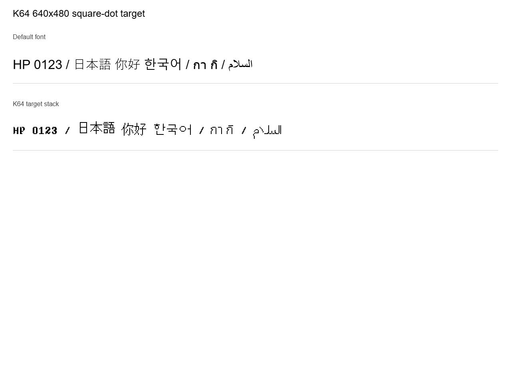

# k64-fonts

komm64 pixel font ecosystem — source TTFs + web-baked WOFF2s for CDN distribution.

## Preview

### 640x240 tall-dot target



### 320x240 square-dot target



### 640x480 square-dot target



Open the live browser sample:
https://komm64.github.io/k64-fonts/web/sample.html

The live sample compares K64F, J (Shinonome), CK (Unifont), Thai and Arabic
pixel fonts, smooth Thai alternate rendering, and scanline variants at the intended
`font-size: 32px` display size.

## Locale font stacks

`k64-locale.json` is the source-of-truth stack manifest.  The normal stack and
the Japanese stack use the same role set, but swap the CK/J priority:

| Stack | Order |
|-------|-------|
| Default | Thai -> Arabic -> K64F -> CK (Unifont) -> J (Shinonome) |
| Japanese text | Thai -> Arabic -> K64F -> J (Shinonome) -> CK (Unifont) |

## 320x240 / 12px font set

The 320x240 monitor target uses a separate 12px square-dot set under
`game/320x240/` and `web/320x240/`.  These files are intentionally separate
from the existing 640x240 Reecho `y1`/`y2x` fonts.

| File | Source | Notes |
|------|--------|-------|
| `k64-320-j-shinonome-mincho-12px.ttf` / `.woff2` | JF-Dot Shinonome Mincho 12px | Embedded 12px bitmap kept intact; baseline metrics fixed to `ascent=12px / descent=0px`. |
| `k64-320-ck-unifont-12px.ttf` / `.woff2` | GNU Unifont 16px | 16px -> 12px `drop-bridge` conversion for the CK role. |
| `k64-320-thai-light-12px-mark16-max2.ttf` / `.woff2` | Noto Sans Thai Light | 12px base glyphs; Thai marks are rendered at 16px, aligned to the 12px mark position, then only colliding upper marks are raised by up to 2px. |
| `k64-320-arabic-light-12px.ttf` / `.woff2` | Noto Sans Arabic Light | Direct 12px mono pixel render with Arabic shaping tables preserved. |

Distribution paths:

| Target | Files |
|--------|-------|
| Game / Godot / Reecho-style runtime | `game/320x240/*.ttf` |
| Web / CDN | `web/320x240/*.woff2` |

Use the 320x240 J/CK/Thai/Arabic fonts at `font-size: 12px` on a square-dot 320x240 surface.
K64F stays dot-by-dot at its native `font-size: 16px` grid.
The 640x240 `y1`/`y2x` fonts remain in the existing `game/` and `web/` root
paths for the tall-dot Reecho target.

## 640x480 / 16px font set

The 640x480 monitor target uses a separate 16px square-dot set under
`game/640x480/` and `web/640x480/`.

| File | Source | Notes |
|------|--------|-------|
| `k64-640x480-j-shinonome-mincho-16px.ttf` / `.woff2` | JF-Dot Shinonome Mincho 16px | Embedded 16px bitmap kept intact; baseline metrics fixed to `ascent=16px / descent=0px`. |
| `k64-640x480-ck-unifont-16px.ttf` / `.woff2` | GNU Unifont 16px | Original Unifont 16px glyphs with bottom-aligned line metrics. |
| `k64-640x480-thai-light-16px.ttf` / `.woff2` | Noto Sans Thai Light | Direct 16px mono pixel render with Thai shaping and mark positioning tables preserved. |
| `k64-640x480-arabic-light-16px.ttf` / `.woff2` | Noto Sans Arabic Light | Direct 16px mono pixel render with Arabic shaping tables preserved. |

Use the 640x480 J/CK/Thai/Arabic fonts at `font-size: 16px` on a square-dot
640x480 surface. K64F also stays dot-by-dot at its native `font-size: 16px`
grid for this target.

## Quick start (web)

Reference fonts from this repo via jsDelivr CDN. Example CSS:

```css
@font-face {
  font-family: 'K64 Fantasy';
  src: url('https://cdn.jsdelivr.net/gh/komm64/k64-fonts/web/k64-fantasy-2x.woff2') format('woff2');
}
@font-face {
  font-family: 'K64 J';
  src: url('https://cdn.jsdelivr.net/gh/komm64/k64-fonts/web/k64-JF-Dot-ShinonomeMin16-or12-y2x.woff2') format('woff2');
}
@font-face {
  font-family: 'K64 CK';
  src: url('https://cdn.jsdelivr.net/gh/komm64/k64-fonts/web/k64-unifont-16px-or12-y2x.woff2') format('woff2');
}
@font-face {
  font-family: 'K64 Thai';
  src: url('https://cdn.jsdelivr.net/gh/komm64/k64-fonts/web/k64-thai-pixel-12w-or12-y2x-prop.woff2') format('woff2');
  unicode-range: U+0E00-0E7F;
}
@font-face {
  font-family: 'K64 Arabic';
  src: url('https://cdn.jsdelivr.net/gh/komm64/k64-fonts/web/k64-arabic-sans-medium-pixel-20px-thin-y2x.woff2') format('woff2');
  unicode-range: U+0600-06FF, U+0750-077F, U+08A0-08FF, U+FB50-FDFF, U+FE70-FEFF;
}

body {
  font-size: 32px;
  font-family: 'K64 Thai', 'K64 Arabic', 'K64 Fantasy', 'K64 CK', 'K64 J', monospace;
}
:lang(ja) { font-family: 'K64 Thai', 'K64 Arabic', 'K64 Fantasy', 'K64 J', 'K64 CK', monospace; }
:lang(zh), :lang(zh-Hans), :lang(zh-Hant), :lang(ko) {
  font-family: 'K64 Thai', 'K64 Arabic', 'K64 Fantasy', 'K64 CK', 'K64 J', monospace;
}
:lang(th) { font-family: 'K64 Thai', 'K64 Arabic', 'K64 Fantasy', 'K64 CK', 'K64 J', monospace; }
:lang(ar) {
  font-family: 'K64 Thai', 'K64 Arabic', 'K64 Fantasy', 'K64 CK', 'K64 J', monospace;
  direction: rtl;
  font-size: 1.25em;   /* 20px source on a 16px/x2 rhythm */
  line-height: 0.8;    /* keep the line box on the original 32px rhythm */
}
```

Pin a specific release tag for stability: `cdn.jsdelivr.net/gh/komm64/k64-fonts@vX.Y/web/...`

### 320x240 web CSS

```css
@font-face {
  font-family: 'K64 320 K64F';
  src: url('https://cdn.jsdelivr.net/gh/komm64/k64-fonts/web/k64-fantasy.woff2') format('woff2');
}
@font-face {
  font-family: 'K64 320 J';
  src: url('https://cdn.jsdelivr.net/gh/komm64/k64-fonts/web/320x240/k64-320-j-shinonome-mincho-12px.woff2') format('woff2');
}
@font-face {
  font-family: 'K64 320 CK';
  src: url('https://cdn.jsdelivr.net/gh/komm64/k64-fonts/web/320x240/k64-320-ck-unifont-12px.woff2') format('woff2');
}
@font-face {
  font-family: 'K64 320 Thai';
  src: url('https://cdn.jsdelivr.net/gh/komm64/k64-fonts/web/320x240/k64-320-thai-light-12px-mark16-max2.woff2') format('woff2');
  unicode-range: U+0E00-0E7F;
}
@font-face {
  font-family: 'K64 320 Arabic';
  src: url('https://cdn.jsdelivr.net/gh/komm64/k64-fonts/web/320x240/k64-320-arabic-light-12px.woff2') format('woff2');
  unicode-range: U+0600-06FF, U+0750-077F, U+08A0-08FF, U+FB50-FDFF, U+FE70-FEFF;
}

body {
  font-size: 12px;
  line-height: 1;
  font-family: 'K64 320 Thai', 'K64 320 Arabic', 'K64 320 CK', 'K64 320 J', monospace;
}
:lang(ja) { font-family: 'K64 320 Thai', 'K64 320 Arabic', 'K64 320 J', 'K64 320 CK', monospace; }
:lang(zh), :lang(zh-Hans), :lang(zh-Hant), :lang(ko) {
  font-family: 'K64 320 Thai', 'K64 320 Arabic', 'K64 320 CK', 'K64 320 J', monospace;
}
:lang(th) { font-family: 'K64 320 Thai', 'K64 320 Arabic', 'K64 320 CK', 'K64 320 J', monospace; }
:lang(ar) {
  font-family: 'K64 320 Thai', 'K64 320 Arabic', 'K64 320 CK', 'K64 320 J', monospace;
  direction: rtl;
}

.k64-320-ui {
  font-family: 'K64 320 K64F', monospace;
  font-size: 16px;  /* K64F is rendered dot-by-dot at its native 8x16 grid. */
  line-height: 1;
}
```

### 640x480 web CSS

```css
@font-face {
  font-family: 'K64 640x480 K64F';
  src: url('https://cdn.jsdelivr.net/gh/komm64/k64-fonts/web/k64-fantasy.woff2') format('woff2');
}
@font-face {
  font-family: 'K64 640x480 J';
  src: url('https://cdn.jsdelivr.net/gh/komm64/k64-fonts/web/640x480/k64-640x480-j-shinonome-mincho-16px.woff2') format('woff2');
}
@font-face {
  font-family: 'K64 640x480 CK';
  src: url('https://cdn.jsdelivr.net/gh/komm64/k64-fonts/web/640x480/k64-640x480-ck-unifont-16px.woff2') format('woff2');
}
@font-face {
  font-family: 'K64 640x480 Thai';
  src: url('https://cdn.jsdelivr.net/gh/komm64/k64-fonts/web/640x480/k64-640x480-thai-light-16px.woff2') format('woff2');
  unicode-range: U+0E00-0E7F;
}
@font-face {
  font-family: 'K64 640x480 Arabic';
  src: url('https://cdn.jsdelivr.net/gh/komm64/k64-fonts/web/640x480/k64-640x480-arabic-light-16px.woff2') format('woff2');
  unicode-range: U+0600-06FF, U+0750-077F, U+08A0-08FF, U+FB50-FDFF, U+FE70-FEFF;
}

body {
  font-size: 16px;
  line-height: 1;
  font-family: 'K64 640x480 Thai', 'K64 640x480 Arabic', 'K64 640x480 CK', 'K64 640x480 J', monospace;
}
:lang(ja) {
  font-family: 'K64 640x480 Thai', 'K64 640x480 Arabic', 'K64 640x480 J', 'K64 640x480 CK', monospace;
}
:lang(ar) {
  font-family: 'K64 640x480 Thai', 'K64 640x480 Arabic', 'K64 640x480 CK', 'K64 640x480 J', monospace;
  direction: rtl;
}

.k64-640x480-ui {
  font-family: 'K64 640x480 K64F', monospace;
  font-size: 16px;
  line-height: 1;
}
```

## File suffix legend

- `-or12` — OR-merged (Reecho 4→3 row collapse, 16px → 12px height, `--or-pair 1`)
- `-y2x` — Y axis 2× stretched (each source pixel = 1 disp px wide × 2 disp px tall)
- `-y1` — Reecho game/internal 640x240 target: same X as y2x, but Y is halved so the final display path supplies the tall pixels
- `-scan-erase-upper` / `-scan-erase-lower` — scanline variant; each 1×2 `y2x` dot keeps only the lower/upper 1px half
- `-x2w` — X axis 2× stretched (each source pixel = 2 disp px wide × 1 disp px tall)
- `-2x` — both axes 2× (each source pixel = 2 disp × 2 disp, square dots)
- (no suffix) — source-as-woff2 only (no glyph modifications)

Web target display: `font-size: 32px` with K64F 2x and CK/J or12+y2x sharing a 32px-tall line. K64F 2x advances 16px per monospace glyph on that 32px line, with source design pixels rendered as 2×2 square dots. CK/J or12+y2x also advances 16px, with 24px-tall OR-merged ink on the same line.

Reecho game target: text is rendered into the internal 640x240 surface at `font-size: 16px`, then the final display path makes those pixels vertically tall. Game TTFs therefore use `y1` outlines, not baked-in `y2x` outlines.

## Source fonts (src/) — unmodified originals

| File | Source / Author | License | Notes |
|------|----------------|---------|-------|
| `komm64Fantasy.ttf` | komm64 (this repo) | CC-BY-NC 4.0 | latest version, history via git tags. Metrics are 8px advance on a 16px em at `font-size: 16px`. |
| `JF-Dot-ShinonomeMin12.ttf` | 自由工房 (Jiyukoubou) | Public Domain | unmodified 12px Shinonome Mincho source |
| `JF-Dot-ShinonomeMin16.ttf` | 自由工房 (Jiyukoubou) | Public Domain | unmodified |
| `unifont-16px.ttf` | Roman Czyborra, Paul Hardy et al. (unifoundry.com) | SIL OFL 1.1 | unmodified |
| `NotoSansThai-Regular.ttf` | Google LLC | SIL OFL 1.1 | unmodified |
| `NotoSansThai-Light.ttf` | Google LLC | SIL OFL 1.1 | unmodified Light source for 320x240 and 640x480 Thai |
| `NotoSansArabic-Medium.ttf` | Google LLC / Noto Fonts | SIL OFL 1.1 | unmodified Noto Sans Arabic Medium source |
| `NotoSansArabic-Light.ttf` | Google LLC / Noto Fonts | SIL OFL 1.1 | unmodified Light source for 320x240 and 640x480 Arabic |

Intermediate-stage TTFs (= Reecho's `gen_font.py` output, input to web bake step):

| File | Modifications from upstream |
|------|------------------------------|
| `JF-Dot-ShinonomeMin16_12px_or1.ttf` | OR-merge 16→12 rows via Reecho's `tools/gen_font.py --or-pair 1 --format=ttf` |
| `unifont-16px_12px_or1.ttf` | same |
| `NotoSansThai-Regular_x2w.ttf` | Horizontal 2× via Reecho's `tools/stretch_ttf_x2w.py` (preserves GPOS) |

## Web fonts (web/) — MODIFIED DERIVATIVES

| File | Source | Modifications applied | Display target |
|------|--------|----------------------|-----------------|
| `k64-fantasy.woff2` | `komm64Fantasy.ttf` | woff2 format conversion only | `font-size: 16px` → 8px advance on a 16px line, 1×1 square dots |
| `k64-fantasy-2x.woff2` | `komm64Fantasy.ttf` | all glyph contours + metrics scaled 2× both axes | `font-size: 32px` → 16px advance on a 32px line, 2×2 square dots |
| `k64-JF-Dot-ShinonomeMin16-or12-y2x.woff2` | `JF-Dot-ShinonomeMin16.ttf` | OR-merge to 12 rows + Y axis 2× + Name table rewrite (RFN compliance) | `font-size: 32px` → 16×24 px, 1×2 tall rect dots |
| `k64-unifont-16px-or12-y2x.woff2` | `unifont-16px.ttf` | same as above. Reserved Font Name "Unifont" removed from Name table per OFL §3. | same |
| `k64-thai-pixel-16w-y2x.woff2` | `NotoSansThai-Regular_x2w.ttf` | Rasterized at 16px, fitted so `ก` advances 16px, emitted as 1×2 tall pixel rectangles, preserving GSUB/GPOS mark positioning. RFN "Noto" removed from Name table per OFL §3. | `font-size: 32px` → pixel-art Thai with stacked tone marks |
| `k64-thai-pixel-12w-16h-y2x.woff2` | `NotoSansThai-Regular_x2w.ttf` | Same pipeline as 16w, fitted so `ก` advances 12px while keeping the full 16px source height. Intended as the tall source for later OR-merge compression. | `font-size: 32px` → narrow, tall pixel-art Thai |
| `k64-thai-pixel-12w-or12-y2x.woff2` | `NotoSansThai-Regular_x2w.ttf` | Starts from the 12w/16h raster and compresses rows with 4→3 OR merge, preserving horizontal strokes better than nearest-neighbor scaling. | `font-size: 32px` → compact 12w Thai |
| `k64-thai-pixel-native12px-y2x-prop.woff2` | `NotoSansThai-Regular_x2w.ttf` | Rasterized directly at 12px with no width fit and no OR merge, then emitted as 1×2 tall pixel rectangles with Noto proportional advances. | `font-size: 32px` → closest match to a 12px Thai TTF rendered through the same 1×2 dot pipeline |
| `k64-NotoSansThai-Regular-x2w.woff2` | `NotoSansThai-Regular.ttf` | Legacy smooth-vector alternate: Horizontal 2× (via Reecho's `stretch_ttf_x2w.py`) preserving GPOS anchors for tone marks. RFN "Noto" removed from Name table per OFL §3. | `font-size: 32px` → ~16-20 wide × 25 tall, smooth |
| `k64-arabic-sans-medium-pixel-20px-thin-y2x.woff2` | `NotoSansArabic-Medium.ttf` | Current web-default Arabic face: rasterized glyph-by-glyph into a 20-row pixel source with a thinner threshold, emitted as y2x outlines with K64F-compatible 12/4 baseline metrics on a 16-row line. GSUB/GPOS are preserved and rescaled for Arabic contextual forms and marks. RFN "Noto" removed from Name table per OFL §3. | Use at `font-size: 40px` with `line-height: 32px`: 20px-sized Arabic glyphs on the same x2 line rhythm as the other fonts |
| `k64-arabic-sans-medium-pixel-y2x.woff2` | `NotoSansArabic-Medium.ttf` | Original 16-row Arabic pixel face, emitted as 1×2 tall pixel rectangles with GSUB/GPOS preserved. RFN "Noto" removed from Name table per OFL §3. | `font-size: 32px` → baseline Arabic pixel font for RTL shaped text |
| `k64-arabic-sans-medium-pixel-20px-y2x.woff2` | `NotoSansArabic-Medium.ttf` | 20-row Arabic size trial, normal threshold. | `font-size: 32px` → same line height as x2 web fonts; `font-size: 40px` → natural 20px source scale |
| `k64-arabic-sans-medium-pixel-24px-y2x.woff2` | `NotoSansArabic-Medium.ttf` | 24-row Arabic size trial, normal threshold. | `font-size: 32px` → same line height as x2 web fonts; `font-size: 48px` → natural 24px source scale |
| `640x480/k64-640x480-j-shinonome-mincho-16px.woff2` | `JF-Dot-ShinonomeMin16.ttf` | 16px embedded bitmap kept intact; baseline metrics fixed for a square-dot 16px cell. | `font-size: 16px` → 16px Japanese |
| `640x480/k64-640x480-ck-unifont-16px.woff2` | `unifont-16px.ttf` | Original 16px Unifont glyphs; baseline metrics fixed for a square-dot 16px cell. | `font-size: 16px` → 16px Chinese/Korean fallback |
| `640x480/k64-640x480-thai-light-16px.woff2` | `NotoSansThai-Light.ttf` | Direct 16px mono pixel rectangles with Thai GSUB/GPOS preserved. | `font-size: 16px` → square-dot Thai |
| `640x480/k64-640x480-arabic-light-16px.woff2` | `NotoSansArabic-Light.ttf` | Direct 16px mono pixel rectangles with Arabic GSUB/GPOS preserved. | `font-size: 16px` → square-dot Arabic |

## Game fonts (game/) — TTF outputs

| File | Notes |
|------|-------|
| `komm64Fantasy_v1.37_16px_bitmap_x2w.fnt` + `_0.png` | Reecho-compatible K64F primary face. Generated as BMFont to avoid FreeType outline rasterization drift at 16ppem; horizontally 2x-wide for the 640x240 CRT signal path. |
| `320x240/k64-320-j-shinonome-mincho-12px.ttf` | 320x240 Japanese face: Shinonome Mincho 12px with baseline fixed to the 12px square-dot cell. |
| `320x240/k64-320-ck-unifont-12px.ttf` | 320x240 CK face: Unifont-derived 12px drop-bridge Chinese/Korean face. |
| `320x240/k64-320-thai-light-12px-mark16-max2.ttf` | 320x240 Thai face: Noto Sans Thai Light pixelized at 12px with 16px marks and collision-aware mark lift. |
| `320x240/k64-320-arabic-light-12px.ttf` | 320x240 Arabic face: Noto Sans Arabic Light pixelized at 12px with shaping tables preserved. |
| `640x480/k64-640x480-j-shinonome-mincho-16px.ttf` | 640x480 Japanese face: Shinonome Mincho 16px with baseline fixed to the 16px square-dot cell. |
| `640x480/k64-640x480-ck-unifont-16px.ttf` | 640x480 CK face: original Unifont 16px with baseline fixed to the 16px square-dot cell. |
| `640x480/k64-640x480-thai-light-16px.ttf` | 640x480 Thai face: Noto Sans Thai Light pixelized at 16px with shaping tables preserved. |
| `640x480/k64-640x480-arabic-light-16px.ttf` | 640x480 Arabic face: Noto Sans Arabic Light pixelized at 16px with shaping tables preserved. |
| `k64-thai-pixel-12w-or12-y1-prop.ttf` | Reecho default Thai game face. 16px source fitted to 12w, compressed with 4→3 OR merge, then converted to y1; this gives the most readable K64F-adjacent pixel look in Reecho's 640x240 internal surface. |
| `k64-thai-pixel-native12px-y1-prop.ttf` | Natural alternate Thai game face. Rasterized directly at 12px, then compressed from y2x to y1 with proportional advances preserved; smoother and less K64F-like than the Reecho default. |
| `k64-arabic-sans-medium-pixel-y1.ttf` | Arabic pixel font: Noto Sans Arabic Medium rasterized with GSUB/GPOS preserved, then compressed from y2x to y1 for Reecho's internal surface. |
| `k64-arabic-sans-medium-pixel-20px-y1.ttf` | 20px Arabic size trial for Reecho game rendering. |
| `k64-arabic-sans-medium-pixel-20px-thin-y1.ttf` | 20px thinner Arabic trial for Reecho game rendering. |
| `k64-arabic-sans-medium-pixel-24px-y1.ttf` | 24px Arabic size trial for Reecho game rendering. |

## Attribution / Copyright

- **GNU Unifont**: Copyright (c) 1998-2024 Roman Czyborra, Paul Hardy, Andrew Miller, et al. Licensed under SIL OFL 1.1. See `LICENSE/OFL-1.1.txt`.
- **Noto Sans Thai**: Copyright (c) 2018 Google LLC. Licensed under SIL OFL 1.1. See `LICENSE/OFL-1.1.txt`.
- **Noto Sans Arabic**: Copyright (c) Google LLC. Licensed under SIL OFL 1.1. See `LICENSE/OFL-1.1.txt`.
- **JF-Dot family**: by 自由工房 (Jiyukoubou). Public Domain. See `LICENSE/PDS-JF-Dot.txt`.
- **komm64Fantasy**: Copyright (c) 2026 komm64. Licensed under CC-BY-NC 4.0. See `LICENSE/CC-BY-NC-4.0.txt`.

Modifications to OFL-licensed fonts are released under OFL 1.1 per §3 (= derivative versions must remain under OFL). Modifications to komm64Fantasy are bound by CC-BY-NC 4.0.

## Tools (tools/) — bake + QA scripts

| Script | Purpose |
|--------|---------|
| `bake_web_fonts.py` | Main bake: source TTFs → web/*.woff2. Uses Reecho's `gen_font.py`-produced or12 intermediates as input |
| `bake_320x240_fonts.py` | Final 320x240 / 12px square-dot set bake |
| `bake_640x480_fonts.py` | Final 640x480 / 16px square-dot set bake |
| `bake_unifont_12px_drop.py` | Unifont 16px → 12px CK converter used by the 320x240 bake |
| `bake_thai_pixel.py` | Thai pixelization — rasterize NotoSansThai → pixel-rect contours, preserve GPOS |
| `bake_arabic_pixel.py` | Arabic pixelization — rasterize Noto Sans Arabic by glyph name, preserve GSUB/GPOS shaping, emit web y2x WOFF2 + game y1 TTF |
| `compress_y2x_to_y1.py` | Reecho game conversion — halve Y coordinates/metrics/GPOS Y values so y2x TTFs render correctly into the internal 640x240 surface |
| `gen_font.py` | Reecho's OR-merge bake (16px TTF → 12px pixel-outline TTF or BMFont) |
| `stretch_ttf_x2w.py` | Reecho's horizontal 2× scaler (preserves GPOS anchors) |
| `inspect_font.py` | Probe glyph coverage, metrics, OFL compliance |
| `render_pangrams.py` | Multi-language pangram visual QA |
| `render_readcheck.py` | Confusable-pair visual QA (Il1, O0, rn/m, etc.) |
| `diff_fonts.py` | Glyph + metrics diff between two TTFs |
| `render_readme_previews.py` | Render the README preview images for the 640x240, 320x240, and 640x480 targets |

Regenerate web fonts:

```bash
# Step 1: produce or-merge intermediates (if not present in src/)
python tools/gen_font.py src/JF-Dot-ShinonomeMin16.ttf --or-pair 1 --format ttf --output-dir src/
python tools/gen_font.py src/unifont-16px.ttf --or-pair 1 --format ttf --output-dir src/
python tools/stretch_ttf_x2w.py src/NotoSansThai-Regular.ttf

# Step 2: bake web woff2
python tools/bake_web_fonts.py

# Optional: also regenerate the large Unifont CK font (slow; ~57k glyphs)
python tools/bake_web_fonts.py --include-unifont

# Optional: generate scanline variants for y2x fonts
python tools/bake_web_fonts.py --scanline erase-upper
python tools/bake_web_fonts.py --scanline erase-lower

# Unifont scanline WOFF2s are large; scanline builds use no glyf transform
# to avoid multi-hour WOFF2 compression.

# Arabic baseline 16px outputs: web y2x WOFF2 + game y1 TTF + preview PNG
python tools/bake_arabic_pixel.py

# Arabic current web default: 20px thin outlines with K64F-compatible 12/4 metrics on a 16px line
python tools/bake_arabic_pixel.py --rows 20 --metric-rows 16 --metric-ascent-rows 12 --threshold 144 --name-suffix Thin --web-output web/k64-arabic-sans-medium-pixel-20px-thin-y2x.woff2 --game-output game/k64-arabic-sans-medium-pixel-20px-thin-y1.ttf --preview-output game/k64-arabic-sans-medium-pixel-20px-thin-y1.preview.png
```

Generate game TTFs:

```bash
# Bake Thai y2x intermediates, then compress to Reecho's 640x240 y1 game TTFs.
python tools/bake_thai_pixel.py --fit-mode native --raster-size 12 --height-mode full --advance-mode noto-proportional --min-right-bearing-px 1 --output tmp-thai-native12px-y2x-prop.ttf
python tools/compress_y2x_to_y1.py tmp-thai-native12px-y2x-prop.ttf game/k64-thai-pixel-native12px-y1-prop.ttf
python tools/bake_thai_pixel.py --target-width 12 --height-mode or12 --advance-mode noto-proportional --min-right-bearing-px 1 --output tmp-thai-12w-or12-y2x-prop.ttf
python tools/compress_y2x_to_y1.py tmp-thai-12w-or12-y2x-prop.ttf game/k64-thai-pixel-12w-or12-y1-prop.ttf

# Arabic baseline 16px emits web y2x WOFF2 and game y1 TTF in one step.
python tools/bake_arabic_pixel.py

# Arabic size/thin trials use explicit rows/output names.
python tools/bake_arabic_pixel.py --rows 20 --web-output web/k64-arabic-sans-medium-pixel-20px-y2x.woff2 --game-output game/k64-arabic-sans-medium-pixel-20px-y1.ttf --preview-output game/k64-arabic-sans-medium-pixel-20px-y1.preview.png
python tools/bake_arabic_pixel.py --rows 20 --metric-rows 16 --metric-ascent-rows 12 --threshold 144 --name-suffix Thin --web-output web/k64-arabic-sans-medium-pixel-20px-thin-y2x.woff2 --game-output game/k64-arabic-sans-medium-pixel-20px-thin-y1.ttf --preview-output game/k64-arabic-sans-medium-pixel-20px-thin-y1.preview.png
python tools/bake_arabic_pixel.py --rows 24 --web-output web/k64-arabic-sans-medium-pixel-24px-y2x.woff2 --game-output game/k64-arabic-sans-medium-pixel-24px-y1.ttf --preview-output game/k64-arabic-sans-medium-pixel-24px-y1.preview.png

# 320x240 / 12px square-dot set.
# Note: CK WOFF2 compression is slow because the font has many glyphs.
python tools/bake_320x240_fonts.py

# 640x480 / 16px square-dot set.
# Note: CK WOFF2 compression is slow because the font has many glyphs.
python tools/bake_640x480_fonts.py

# README preview images for all monitor targets.
python tools/render_readme_previews.py
```

Local browser sample:

```bash
python -m http.server 8765 --directory web
# then open http://127.0.0.1:8765/sample.html
```

Thai proportional advance experiment:

```bash
# Keep pixel-snapped outlines, but preserve Noto hmtx advance proportions.
# Default is --advance-mode pixel-snap for backward-compatible web outputs.
python tools/bake_thai_pixel.py --target-width 12 --height-mode or12 --advance-mode noto-proportional

# Middle ground: preserve Noto proportions but snap advances to 0.5 display px.
python tools/bake_thai_pixel.py --target-width 12 --height-mode or12 --advance-mode noto-proportional-half-px
```

## Repo structure

```
k64-fonts/
├── README.md                this file
├── k64-locale.json          role order for default and Japanese locale stacks
├── LICENSE/
│   ├── CC-BY-NC-4.0.txt     komm64Fantasy
│   ├── OFL-1.1.txt           Unifont + Noto derivatives
│   └── PDS-JF-Dot.txt       JF-Dot attribution
├── src/                     unmodified source TTFs + or-merge intermediates
├── web/                     baked woff2 for CDN
└── tools/                   bake + QA scripts
```

## Known issues

- Thai pixel font is generated from NotoSansThai at 16px, so a few complex mark variants may still need visual QA in browser text shaping. The previous smooth alternate remains available as `web/k64-NotoSansThai-Regular-x2w.woff2`.

## Versioning

`komm64Fantasy.ttf` history is tracked via git tags. Older versions can be checked out by tag (e.g. `git checkout v1.37 -- src/komm64Fantasy.ttf`).
