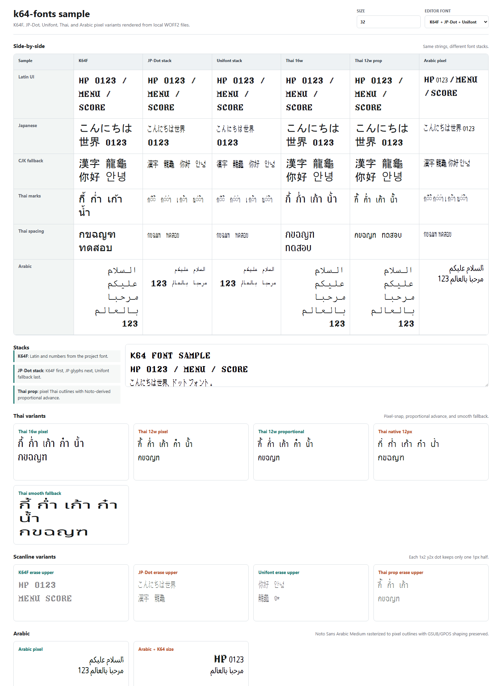

# k64-fonts

komm64 pixel font ecosystem — source TTFs + web-baked WOFF2s for CDN distribution.

## Preview



Open the live browser sample:
https://komm64.github.io/k64-fonts/web/sample.html

The sample compares K64 Fantasy, JP/CJK fallback, Thai pixel fonts, smooth Thai fallback, and scanline variants at the intended `font-size: 32px` display size.

## Quick start (web)

Reference fonts from this repo via jsDelivr CDN. Example CSS:

```css
@font-face {
  font-family: 'K64 Fantasy';
  src: url('https://cdn.jsdelivr.net/gh/komm64/k64-fonts/web/k64-fantasy-2x.woff2') format('woff2');
}
@font-face {
  font-family: 'K64 CJK JP';
  src: url('https://cdn.jsdelivr.net/gh/komm64/k64-fonts/web/k64-JF-Dot-ShinonomeMin16-or12-y2x.woff2') format('woff2');
}
@font-face {
  font-family: 'K64 CJK Fallback';
  src: url('https://cdn.jsdelivr.net/gh/komm64/k64-fonts/web/k64-unifont-16px-or12-y2x.woff2') format('woff2');
}
@font-face {
  font-family: 'K64 Thai';
  src: url('https://cdn.jsdelivr.net/gh/komm64/k64-fonts/web/k64-thai-pixel-16w-y2x.woff2') format('woff2');
}

body { font-size: 32px; }
:lang(ja) { font-family: 'K64 Fantasy', 'K64 CJK JP', 'K64 CJK Fallback', monospace; }
:lang(zh), :lang(zh-Hans), :lang(zh-Hant) { font-family: 'K64 Fantasy', 'K64 CJK Fallback', monospace; }
:lang(ko) { font-family: 'K64 Fantasy', 'K64 CJK Fallback', monospace; }
:lang(th) { font-family: 'K64 Fantasy', 'K64 Thai', monospace; }
```

Pin a specific release tag for stability: `cdn.jsdelivr.net/gh/komm64/k64-fonts@vX.Y/web/...`

## File suffix legend

- `-or12` — OR-merged (Reecho 4→3 row collapse, 16px → 12px height, `--or-pair 1`)
- `-y2x` — Y axis 2× stretched (each source pixel = 1 disp px wide × 2 disp px tall)
- `-scan-erase-upper` / `-scan-erase-lower` — scanline variant; each 1×2 `y2x` dot keeps only the lower/upper 1px half
- `-x2w` — X axis 2× stretched (each source pixel = 2 disp px wide × 1 disp px tall)
- `-2x` — both axes 2× (each source pixel = 2 disp × 2 disp, square dots)
- (no suffix) — source-as-woff2 only (no glyph modifications)

Target display: `font-size: 32px` with K64F 2x and CJK or12+y2x giving matched 32px-tall line; CJK glyph ink at 24px tall, Latin at 32px tall.

## Source fonts (src/) — unmodified originals

| File | Source / Author | License | Notes |
|------|----------------|---------|-------|
| `komm64Fantasy.ttf` | komm64 (this repo) | CC-BY-NC 4.0 | latest version, history via git tags |
| `JF-Dot-ShinonomeMin16.ttf` | 自由工房 (Jiyukoubou) | Public Domain | unmodified |
| `unifont-16px.ttf` | Roman Czyborra, Paul Hardy et al. (unifoundry.com) | SIL OFL 1.1 | unmodified |
| `NotoSansThai-Regular.ttf` | Google LLC | SIL OFL 1.1 | unmodified |

Intermediate-stage TTFs (= Reecho's `gen_font.py` output, input to web bake step):

| File | Modifications from upstream |
|------|------------------------------|
| `JF-Dot-ShinonomeMin16_12px_or1.ttf` | OR-merge 16→12 rows via Reecho's `tools/gen_font.py --or-pair 1 --format=ttf` |
| `unifont-16px_12px_or1.ttf` | same |
| `NotoSansThai-Regular_x2w.ttf` | Horizontal 2× via Reecho's `tools/stretch_ttf_x2w.py` (preserves GPOS) |

## Web fonts (web/) — MODIFIED DERIVATIVES

| File | Source | Modifications applied | Display target |
|------|--------|----------------------|-----------------|
| `k64-fantasy.woff2` | `komm64Fantasy.ttf` | woff2 format conversion only | `font-size: 16px` → 16×16 px square dots |
| `k64-fantasy-2x.woff2` | `komm64Fantasy.ttf` | all glyph contours + metrics scaled 2× both axes | `font-size: 32px` → 32×32 px, 2×2 square dots |
| `k64-JF-Dot-ShinonomeMin16-or12-y2x.woff2` | `JF-Dot-ShinonomeMin16.ttf` | OR-merge to 12 rows + Y axis 2× + Name table rewrite (RFN compliance) | `font-size: 32px` → 16×24 px, 1×2 tall rect dots |
| `k64-unifont-16px-or12-y2x.woff2` | `unifont-16px.ttf` | same as above. Reserved Font Name "Unifont" removed from Name table per OFL §3. | same |
| `k64-thai-pixel-16w-y2x.woff2` | `NotoSansThai-Regular_x2w.ttf` | Rasterized at 16px, fitted so `ก` advances 16px, emitted as 1×2 tall pixel rectangles, preserving GSUB/GPOS mark positioning. RFN "Noto" removed from Name table per OFL §3. | `font-size: 32px` → pixel-art Thai with stacked tone marks |
| `k64-thai-pixel-12w-16h-y2x.woff2` | `NotoSansThai-Regular_x2w.ttf` | Same pipeline as 16w, fitted so `ก` advances 12px while keeping the full 16px source height. Intended as the tall source for later OR-merge compression. | `font-size: 32px` → narrow, tall pixel-art Thai |
| `k64-thai-pixel-12w-or12-y2x.woff2` | `NotoSansThai-Regular_x2w.ttf` | Starts from the 12w/16h raster and compresses rows with 4→3 OR merge, preserving horizontal strokes better than nearest-neighbor scaling. | `font-size: 32px` → compact 12w Thai |
| `k64-thai-pixel-native12px-y2x-prop.woff2` | `NotoSansThai-Regular_x2w.ttf` | Rasterized directly at 12px with no width fit and no OR merge, then emitted as 1×2 tall pixel rectangles with Noto proportional advances. | `font-size: 32px` → closest match to a 12px Thai TTF rendered through the same 1×2 dot pipeline |
| `k64-NotoSansThai-Regular-x2w.woff2` | `NotoSansThai-Regular.ttf` | Legacy smooth-vector fallback: Horizontal 2× (via Reecho's `stretch_ttf_x2w.py`) preserving GPOS anchors for tone marks. RFN "Noto" removed from Name table per OFL §3. | `font-size: 32px` → ~16-20 wide × 25 tall, smooth |

## Game fonts (game/) — TTF outputs

| File | Notes |
|------|-------|
| `komm64Fantasy_v1.37_16px_bitmap_x2w.fnt` + `_0.png` | Reecho-compatible K64F primary face. Generated as BMFont to avoid FreeType outline rasterization drift at 16ppem; horizontally 2x-wide for the 640x240 CRT signal path. |
| `k64-thai-pixel-native12px-y2x-prop.ttf` | Recommended natural Thai 12px source: rasterized directly at 12px, emitted as 1×2 rectangular dots, proportional advances preserved. |
| `k64-thai-pixel-12w-or12-y2x-prop.ttf` | More stylized compact Thai: 16px source fitted to 12w, 4→3 OR merge, proportional advances preserved. |

## Attribution / Copyright

- **GNU Unifont**: Copyright (c) 1998-2024 Roman Czyborra, Paul Hardy, Andrew Miller, et al. Licensed under SIL OFL 1.1. See `LICENSE/OFL-1.1.txt`.
- **Noto Sans Thai**: Copyright (c) 2018 Google LLC. Licensed under SIL OFL 1.1. See `LICENSE/OFL-1.1.txt`.
- **JF-Dot family**: by 自由工房 (Jiyukoubou). Public Domain. See `LICENSE/PDS-JF-Dot.txt`.
- **komm64Fantasy**: Copyright (c) 2026 komm64. Licensed under CC-BY-NC 4.0. See `LICENSE/CC-BY-NC-4.0.txt`.

Modifications to OFL-licensed fonts are released under OFL 1.1 per §3 (= derivative versions must remain under OFL). Modifications to komm64Fantasy are bound by CC-BY-NC 4.0.

## Tools (tools/) — bake + QA scripts

| Script | Purpose |
|--------|---------|
| `bake_web_fonts.py` | Main bake: source TTFs → web/*.woff2. Uses Reecho's `gen_font.py`-produced or12 intermediates as input |
| `bake_thai_pixel.py` | Thai pixelization — rasterize NotoSansThai → pixel-rect contours, preserve GPOS |
| `gen_font.py` | Reecho's OR-merge bake (16px TTF → 12px pixel-outline TTF or BMFont) |
| `stretch_ttf_x2w.py` | Reecho's horizontal 2× scaler (preserves GPOS anchors) |
| `inspect_font.py` | Probe glyph coverage, metrics, OFL compliance |
| `render_pangrams.py` | Multi-language pangram visual QA |
| `render_readcheck.py` | Confusable-pair visual QA (Il1, O0, rn/m, etc.) |
| `diff_fonts.py` | Glyph + metrics diff between two TTFs |

Regenerate web fonts:

```bash
# Step 1: produce or-merge intermediates (if not present in src/)
python tools/gen_font.py src/JF-Dot-ShinonomeMin16.ttf --or-pair 1 --format ttf --output-dir src/
python tools/gen_font.py src/unifont-16px.ttf --or-pair 1 --format ttf --output-dir src/
python tools/stretch_ttf_x2w.py src/NotoSansThai-Regular.ttf

# Step 2: bake web woff2
python tools/bake_web_fonts.py

# Optional: also regenerate the large Unifont fallback (slow; ~57k glyphs)
python tools/bake_web_fonts.py --include-unifont

# Optional: generate scanline variants for y2x fonts
python tools/bake_web_fonts.py --scanline erase-upper
python tools/bake_web_fonts.py --scanline erase-lower

# Unifont scanline WOFF2s are large; scanline builds use no glyf transform
# to avoid multi-hour WOFF2 compression.
```

Generate game TTFs:

```bash
python tools/bake_thai_pixel.py --fit-mode native --raster-size 12 --height-mode full --advance-mode noto-proportional --min-right-bearing-px 1 --output game/k64-thai-pixel-native12px-y2x-prop.ttf
python tools/bake_thai_pixel.py --target-width 12 --height-mode or12 --advance-mode noto-proportional --min-right-bearing-px 1 --output game/k64-thai-pixel-12w-or12-y2x-prop.ttf
```

Local browser sample:

```bash
python -m http.server 8765 --directory web
# then open http://127.0.0.1:8765/sample.html
```

Thai proportional advance experiment:

```bash
# Keep pixel-snapped outlines, but preserve Noto hmtx advance proportions.
# Default is --advance-mode pixel-snap for backward-compatible web outputs.
python tools/bake_thai_pixel.py --target-width 12 --height-mode or12 --advance-mode noto-proportional

# Middle ground: preserve Noto proportions but snap advances to 0.5 display px.
python tools/bake_thai_pixel.py --target-width 12 --height-mode or12 --advance-mode noto-proportional-half-px
```

## Repo structure

```
k64-fonts/
├── README.md                this file
├── LICENSE/
│   ├── CC-BY-NC-4.0.txt     komm64Fantasy
│   ├── OFL-1.1.txt           Unifont + Noto derivatives
│   └── PDS-JF-Dot.txt       JF-Dot attribution
├── src/                     unmodified source TTFs + or-merge intermediates
├── web/                     baked woff2 for CDN
└── tools/                   bake + QA scripts
```

## Known issues

- Thai pixel font is generated from NotoSansThai at 16px, so a few complex mark variants may still need visual QA in browser text shaping. The previous smooth fallback remains available as `web/k64-NotoSansThai-Regular-x2w.woff2`.

## Versioning

`komm64Fantasy.ttf` history is tracked via git tags. Older versions can be checked out by tag (e.g. `git checkout v1.37 -- src/komm64Fantasy.ttf`).
